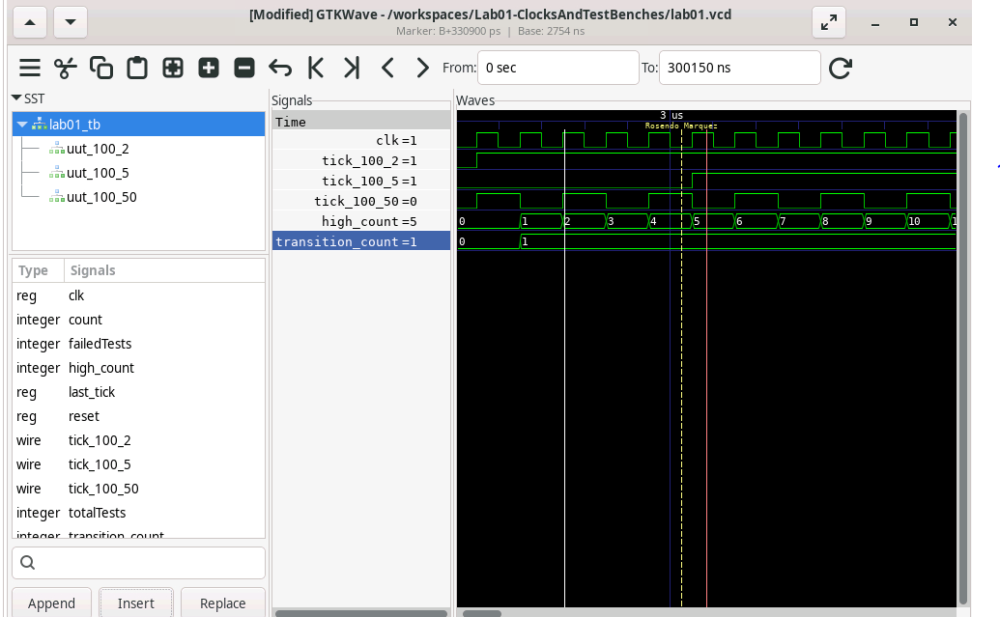

# Lab Report

- **Name:** Rosendo Marquez
- **Email:** rosendomarquez30@gmail.com

## Project Description

In the testbench, we added two more test cases that both ran at the source clock cycle of 100Hz but with a tick frequency of 2Hz. The test runs for 1000 clock cycles and counts the number of times the tick signal transitions from 0 to 1. 

The first test case added was at a tick of 5Hz. This means that there should be a transition count of 50, as \( \frac{1000}{100} \times 50 = 50 \).

The same applies for the third test case of 50Hz, which has a transition count of 500. By changing the first test case we were able to correctly test gen_tick.v to be a suitable clock multiplier 

